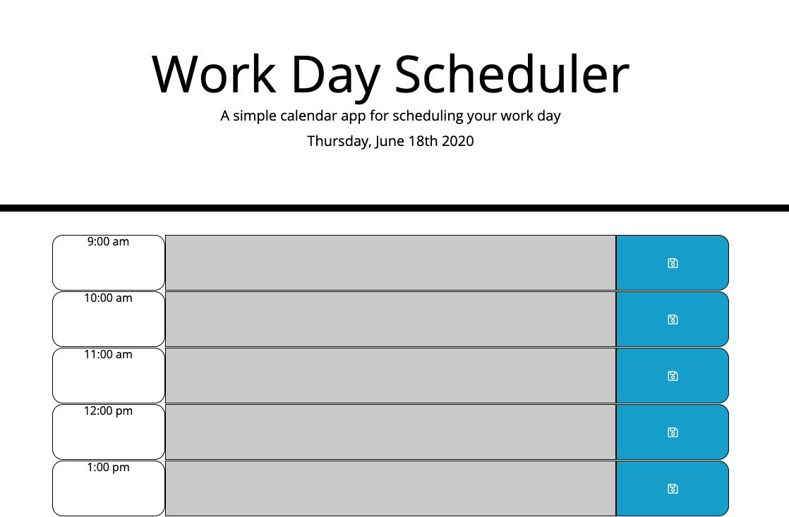

Here is the link to my repo: https://github.com/zackdeacon/Work-Day-Scheduler-Homework
Here is the link to the deployed page: 

I created a schedule planner that will change color dependant on the time of day, it will grey out the input fields if its past that time and color them green if that time is in the future. The current time will be red. 

When you type into the input fields and hit save, the text will be saved to local storage for future use. 

The page will always load with the current date and time. 

Below is an example of what it looks like!

